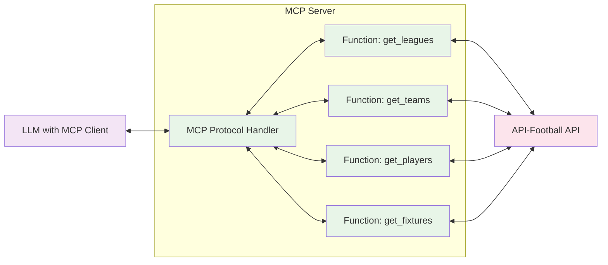

# API-Football MCP Server

A Model Context Protocol (MCP) server that provides access to football/soccer data through the API-Football service.


## Architecture




## 1. Clone and Setup

Clone the repository:
```
git clone https://github.com/your-username/api-football-mcp.git
cd api-football-mcp
```

Install dependencies:
```
pip install -r requirements.txt
```

## 2. Get Your API Key and Set Environment

Create a `.env` file with your credentials:
```env
API_FOOTBALL_KEY=your_api_key_here
API_FOOTBALL_HOST=v3.football.api-sports.io
```

Sign up on [API-Football](https://dashboard.api-football.com/) to get an API key.

## 3. Configure MCP Client

Register this server in your MCP client (e.g., Claude for Desktop).

Or run directly from the command line and explore with [Inspector](https://github.com/modelcontextprotocol/inspector):
```
python main.py
```

## Tools

The following tools are exposed to MCP clients:

| Tool Name | Description | Parameters |
|-----------|-------------|------------|
| get_leagues | Get available leagues | country (str, optional), season (int, optional) |
| get_teams | Get teams in a league | league_id (int), season (int, optional) |
| get_team_stats | Get statistics for a team | team_id (int), league_id (int), season (int, optional) |
| get_team_id_by_name | Get team ID by team name | team_name (str), league_id (int, optional), season (int, optional) |
| get_players | Get players in a team | team_id (int), season (int) |
| get_player_stats | Get statistics for a player | player_id (int), season (int) |
| get_fixtures | Get fixtures/matches | league_id (int, optional), team_id (int, optional), season (int, optional), date (str, optional), next (int, optional), last (int, optional) |
| get_fixture_stats | Get statistics for a fixture | fixture_id (int) |
| get_standings | Get league standings | league_id (int), season (int) |
| get_top_scorers | Get top scorers in a league | league_id (int), season (int) |
| get_top_assists | Get top assisters in a league | league_id (int), season (int) |
| get_venue | Get venue information | venue_id (int) |
| get_team_transfers | Get transfer information for a team | team_id (int) |
| get_injuries | Get injury information | team_id (int), player_id (int), season (int) |
| get_predictions | Get predictions for a fixture | fixture_id (int) |
| get_head_to_head | Get head-to-head statistics between teams | team1_id (int), team2_id (int) |
| get_countries | Get available countries | None |
| get_league_info | Get detailed league information | league_id (int) |

