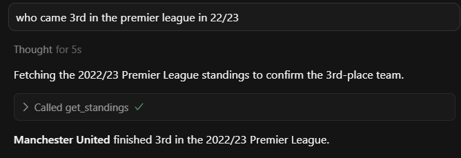
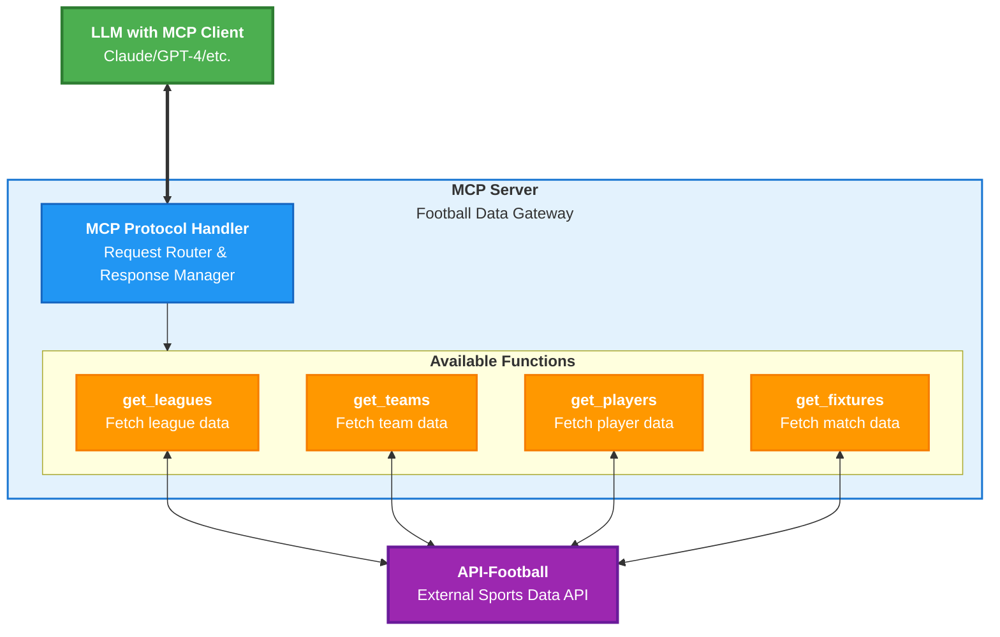

# API-Football MCP Server

A Model Context Protocol (MCP) server that provides access to football/soccer data through the API-Football service.
This creates a standardised way for language models to interact with this API, and users a way to query in natural language.


## Architecture



## 1. Clone and Setup

Clone the repository:
```bash
git clone https://github.com/danknight/api-football-mcp-server.git
cd api-football-mcp-server
```

Install dependencies:
```bash
pip install -r requirements.txt
```

## 2. Get Your API Key and Set Environment

Create a `.env` file with your credentials:
```env
API_FOOTBALL_KEY=your_api_key_here
```

Sign up on [API-Football](https://dashboard.api-football.com/) to get an API key.

## 3. Configure MCP Client

Register this server in your MCP client (e.g. Cursor, Claude for Desktop).

```json
{
  "mcpServers": {
    "api-football": {
      "command": "python",
      "args": ["absolute/path/to/server.py"],
      "env": {
        "API_FOOTBALL_KEY": "YOUR_API_KEY"
      }
    }
  }
}

```

Or run directly from the command line and explore with [Inspector](https://github.com/modelcontextprotocol/inspector):
```bash
python server.py
```

## Tools

The following tools are exposed to MCP clients:

### League Information
| Tool Name | Description | Parameters |
|-----------|-------------|------------|
| `get_leagues` | Get available leagues | `country` (str, optional), `season` (int, optional) |
| `get_league_info` | Get detailed league information | `league_id` (int) |
| `get_countries` | Get available countries | None |
| `get_standings` | Get league standings | `league_id` (int), `season` (int) |

### Team Information
| Tool Name | Description | Parameters |
|-----------|-------------|------------|
| `get_teams` | Get teams in a league | `league_id` (int), `season` (int, optional) |
| `get_team_stats` | Get statistics for a team | `team_id` (int), `league_id` (int), `season` (int, optional) |
| `get_team_id_by_name` | Get team ID by team name | `team_name` (str), `league_id` (int, optional), `season` (int, optional) |
| `get_team_transfers` | Get transfer information for a team | `team_id` (int) |

### Player Information
| Tool Name | Description | Parameters |
|-----------|-------------|------------|
| `get_players` | Get players in a team | `team_id` (int), `season` (int) |
| `get_player_stats` | Get statistics for a player | `player_id` (int), `season` (int) |

### Match/Fixture Information
| Tool Name | Description | Parameters |
|-----------|-------------|------------|
| `get_fixtures` | Get fixtures/matches | `league_id` (int, optional), `team_id` (int, optional), `season` (int, optional), `date` (str, optional), `next` (int, optional), `last` (int, optional) |
| `get_fixture_stats` | Get statistics for a fixture | `fixture_id` (int) |
| `get_predictions` | Get predictions for a fixture | `fixture_id` (int) |
| `get_head_to_head` | Get head-to-head statistics between teams | `team1_id` (int), `team2_id` (int) |

### Player Statistics
| Tool Name | Description | Parameters |
|-----------|-------------|------------|
| `get_top_scorers` | Get top scorers in a league | `league_id` (int), `season` (int) |
| `get_top_assists` | Get top assisters in a league | `league_id` (int), `season` (int) |

### Other Information
| Tool Name | Description | Parameters |
|-----------|-------------|------------|
| `get_venue` | Get venue information | `venue_id` (int) |
| `get_injuries` | Get injury information | `team_id` (int), `player_id` (int), `season` (int) |

## Usage Examples

### Get leagues in a specific country
```python
get_leagues(country="England")
```

### Get teams in a specific league
```python
get_teams(league_id=39, season=2023)  # Premier League 2023
```

### Get team statistics
```python
get_team_stats(team_id=42, league_id=39, season=2023)  # Arsenal stats
```

### Get fixtures for a team
```python
get_fixtures(team_id=42, next=5)  # Next 5 Arsenal matches
```

### Get top scorers in a league
```python
get_top_scorers(league_id=39, season=2023)  # Premier League top scorers
```

## Development

### Running Tests
Currently, no tests are implemented. To add tests:
1. Create a `tests/` directory
2. Add test files following the naming convention `test_*.py`
3. Run tests with `python -m pytest`

### Adding New Tools
To add a new tool:
1. Add a new function in `main.py` decorated with `@mcp.tool()`
2. Implement the API call using `make_api_request()`
3. Update this README with the new tool information
4. Test the tool with the MCP Inspector
